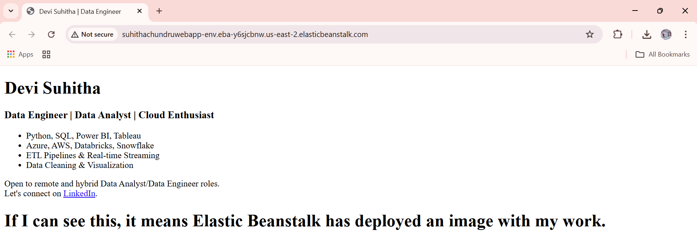

# Deploying a Containerized Web App Using Docker & AWS Elastic Beanstalk  

This project showcases an end-to-end deployment pipeline where I containerized a custom static web application using Docker and deployed it seamlessly to the cloud with AWS Elastic Beanstalk. It demonstrates my ability to design, containerize, and manage web app infrastructure using modern DevOps practices.

---

## 🛠️ Tools & Technologies

- **Docker** – For building and running the container
- **Nginx** – To serve the static HTML content
- **AWS Elastic Beanstalk** – To deploy and manage the app in the cloud
- **IAM, EC2, S3** – Used as part of AWS infrastructure configuration

---

## 📁 Project Structure

- `index.html` – Static webpage content
- `Dockerfile` – Defines the container setup using Nginx
- `screenshots/` – Contains deployment and architecture images
- `Docker_ElasticBeanstalk_WebApp_Deployment.pdf` – Full documentation

---

## 🧭 Project Architecture

Here’s a high-level overview of the deployment workflow:

### Flow Explanation:
1. I created the static HTML (`index.html`) and a Dockerfile to serve it using Nginx.
2. Built a Docker image locally to test the setup.
3. Uploaded and deployed the image as a ZIP file using AWS Elastic Beanstalk.
4. Elastic Beanstalk handled provisioning the EC2 instance, assigning roles, and exposing a public endpoint.

---

## 📚 Documentation

📄 [View Full Project Documentation](Docker_ElasticBeanstalk_WebApp_Deployment_Documentation.pdf)

This PDF includes:
- Project overview
- Docker file explanation
- Step-by-step deployment process
- Screenshots of IAM, Elastic Beanstalk setup, and configuration
- Troubleshooting and verification steps
- IAM roles, monitoring, and deployment policies
- Live deployment verification

---

## 🖼️ Live Preview Screenshot

The live website confirms the Dockerized app was deployed successfully to the cloud using Elastic Beanstalk.

---

## ✅ Key Takeaways

- Containerized and deployed a static web app from scratch
- Configured IAM roles and EC2 instance profiles
- Learned how to manage a deployment using AWS Elastic Beanstalk
- Applied DevOps concepts in a real-world scenario

---

## 📬 Let's Connect

Feel free to connect with me or check out more of my projects:

🔗 [LinkedIn](www.linkedin.com/in/suhithachundru)  
🔗 [GitHub Profile](https://github.com/DeviSuhithaChundru)
