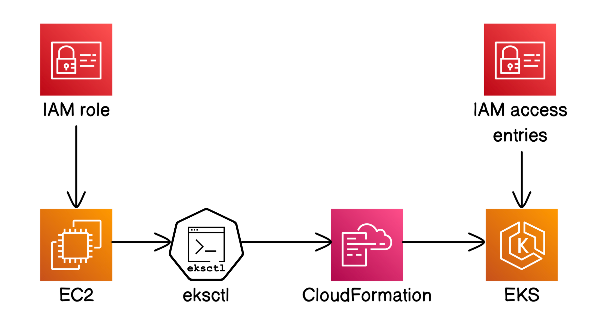

# 🚀 Kubernetes Series – Part 1: Launch a Kubernetes Cluster Using Amazon EKS

---

## 📚 Project Overview

This project is Part 1 of my Kubernetes hands-on learning series.  
In this phase, I launched a fully managed Kubernetes cluster on AWS using **Amazon EKS**, automated via **eksctl**, and deployed supporting infrastructure like **EC2**, **IAM roles**, and **CloudFormation** stacks.

I also tested cluster resilience by simulating node failures and observing Kubernetes' self-healing capabilities.

---

## 🛠️ Tools & Technologies Used

- **Amazon Elastic Kubernetes Service (EKS)** – Managed Kubernetes service for containerized applications
- **Amazon EC2** – Compute instance used to run eksctl and manage the cluster
- **AWS CloudFormation** – Automated infrastructure provisioning
- **AWS IAM** – Managed user roles and permissions for secure access
- **Kubernetes** – Container orchestration platform
- **eksctl** – Command-line tool to automate EKS cluster creation

---

## 🧭 Architecture Overview

High-level view of the EKS cluster provisioning workflow:

EC2 Instance | |---> eksctl Installation |---> Create EKS Cluster via eksctl | |---> AWS CloudFormation provisions networking and nodes | |---> IAM roles and EKS access entries configured | |---> Kubernetes cluster deployed and tested for resilience

---

## ⚙️ Setup Summary

1. Launched an EC2 instance with attached IAM role.
2. Installed `eksctl`
3. Created an EKS cluster using `eksctl create cluster`.
4. Configured Kubernetes access entries through IAM.
5. Terminated a node to validate Kubernetes auto-recovery.

---

## 📸 Key Screenshots

You can view all the setup screenshots here:  
[📂 Screenshots](https://github.com/DeviSuhithaChundru/AWS-Projects/tree/main/Kubernetes/Screenshots)

---

## 📚 Full Documentation

📄 [View Full Project Documentation (PDF)](https://github.com/DeviSuhithaChundru/AWS-Projects/blob/main/Kubernetes/Kubernetes_EKS_Cluster%20Deployment.pdf)

This documentation covers:
- Full deployment walkthrough
- eksctl commands and IAM setup
- CloudFormation stack analysis
- EKS console access setup
- Node termination and auto-healing testing

---

## ✅ Key Takeaways

- Automated Kubernetes cluster creation using **eksctl**
- Understood EKS architecture and AWS service integrations
- Explored IAM role creation, EC2 instance management, and CloudFormation templates
- Observed Kubernetes' self-healing behavior by simulating node failure

---

## 🧹 Clean Up After Deployment

To avoid unnecessary AWS costs, I:
- Deleted the EKS cluster using `eksctl delete cluster`
- Terminated the EC2 instances
- Removed leftover S3 buckets and CloudFormation stacks

---

## 📬 Let's Connect

- 🔗 [LinkedIn](https://www.linkedin.com/in/suhithachundru/)
- 🔗 [GitHub](https://github.com/DeviSuhithaChundru)

---

> *This project is part of my continuous journey to build real-world cloud-native skills using Kubernetes and AWS.*
